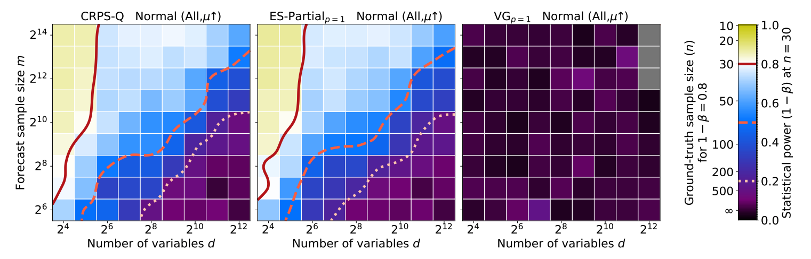

# Regions of Reliability in the Evaluation of Multivariate Probabilistic Forecasts

Étienne Marcotte, Valentina Zantedeschi, Alexandre Drouin, Nicolas Chapados (2022). [Regions of Reliability in the Evaluation of Multivariate Probabilistic Forecasts](https://arxiv.org/abs/2304.09836). International Conference on Machine Learning (ICML 2023).

[[Paper]](https://arxiv.org/abs/2304.09836)

> Multivariate probabilistic time series forecasts are commonly evaluated via proper scoring rules, i.e., functions that are minimal in expectation for the ground-truth distribution. However, this property is not sufficient to guarantee good discrimination in the non-asymptotic regime. In this paper, we provide the first systematic finite-sample study of proper scoring rules for time-series forecasting evaluation. Through a power analysis, we identify the "region of reliability" of a scoring rule, i.e., the set of practical conditions where it can be relied on to identify forecasting errors. We carry out our analysis on a comprehensive synthetic benchmark, specifically designed to test several key discrepancies between ground-truth and forecast distributions, and we gauge the generalizability of our findings to real-world tasks with an application to an electricity production problem. Our results reveal critical shortcomings in the evaluation of multivariate probabilistic forecasts as commonly performed in the literature.




# Contents

All results reported in the paper can be reproduced using the provided [notebooks](https://github.com/ServiceNow/regions-of-reliability/tree/main/notebooks). Some of these require our raw experimental data, which can be found attached to the [releases](https://github.com/ServiceNow/regions-of-reliability/releases).

* [calibrate_experiments.ipynb](./notebooks/calibrate_experiments.ipynb): calibration of the difficulty of the test cases based on the power of the negative log likelihood.
* [optimize_solar.ipynb](./notebooks/optimize_solar.ipynb): real data experiments using the solar dataset.
* [plot_power_vs_epsilon_covariance.ipynb](./notebooks/plot_power_vs_epsilon_covariance.ipynb): produces Figure 9 of the paper.
* [plot_ror_results.ipynb](./notebooks/plot_ror_results.ipynb): plot a single region of reliability heatmap (e.g., Figure 2).
* [plot_ror_results_all.ipynb](./notebooks/plot_ror_results_all.ipynb): plot all region of reliability heatmaps, produce the aggregated results (Figure 8), and generate Table 3.


# Citing this work

Please use the following Bibtex entry:

```
@inproceedings{marcotte2023regions,
  title     = {Regions of Reliability in the Evaluation of Multivariate Probabilistic Forecasts},
  author    = {\'{E}tienne Marcotte and Valentina Zantedeschi and Alexandre Drouin and Nicolas Chapados},
  booktitle = {40th International Conference on Machine Learning},
  year      = {2023},
  url       = {https://arxiv.org/abs/2304.09836}
}
```
